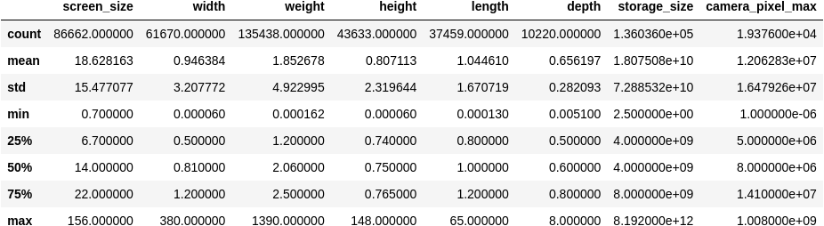
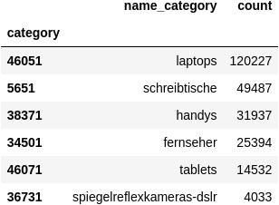
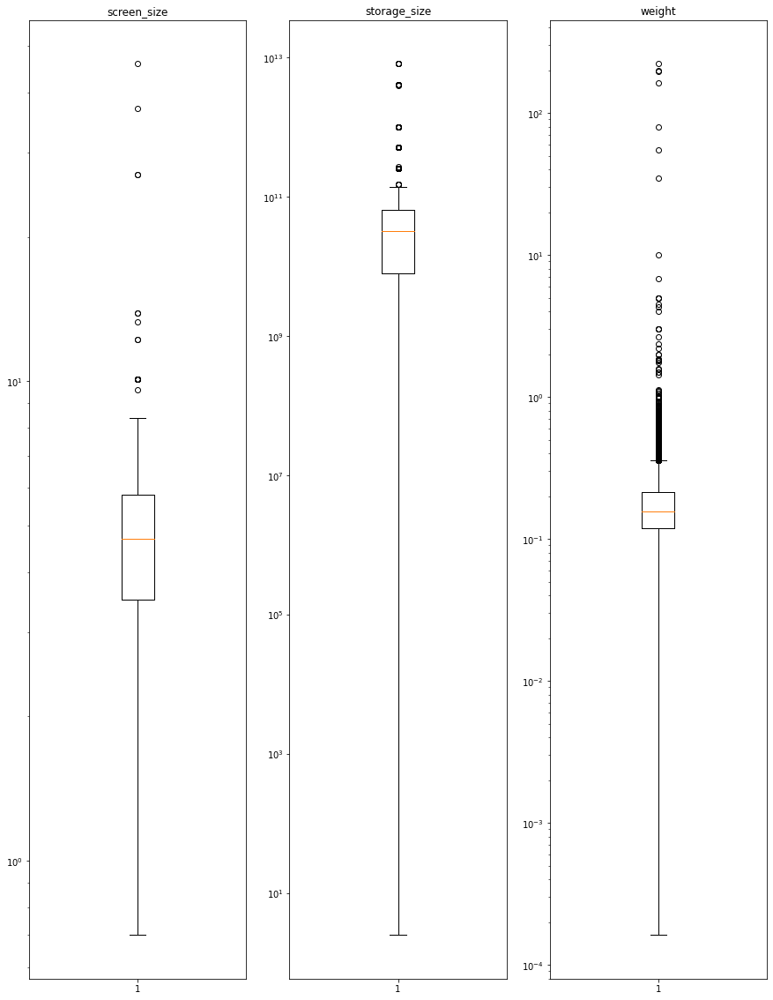
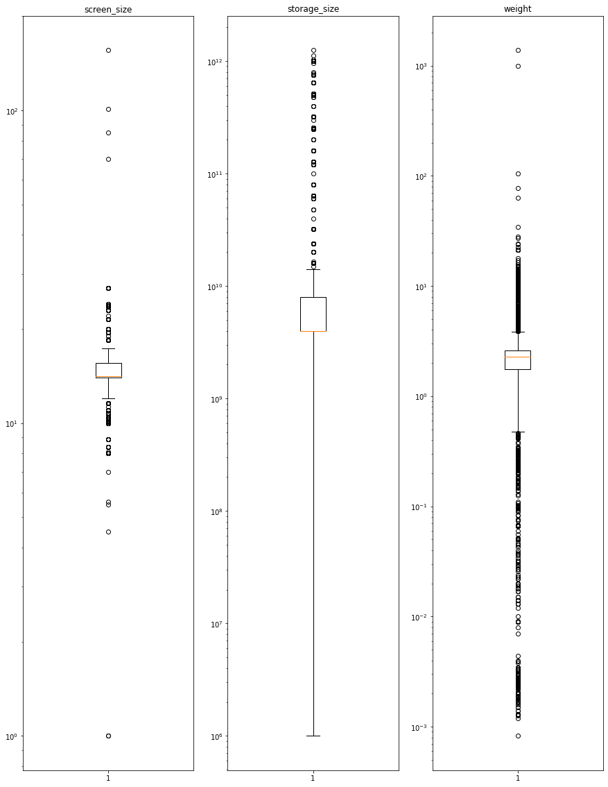
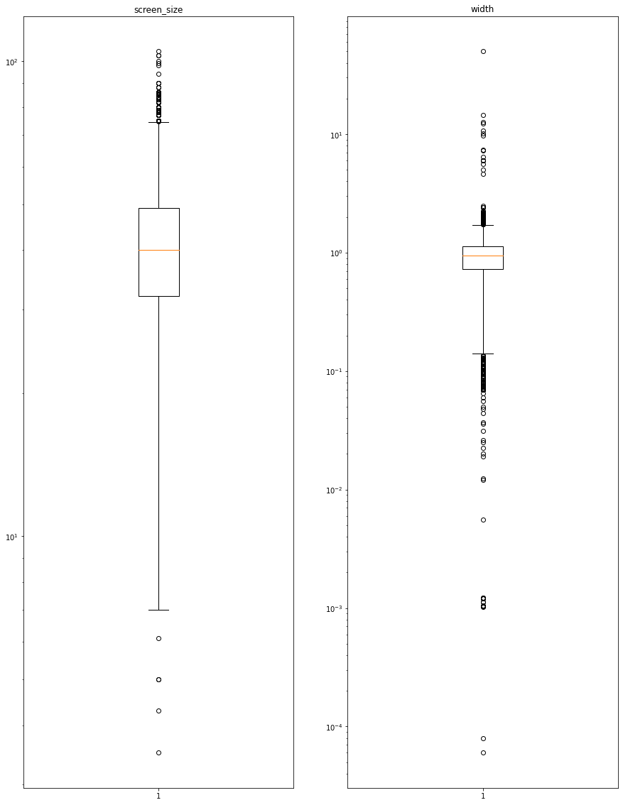
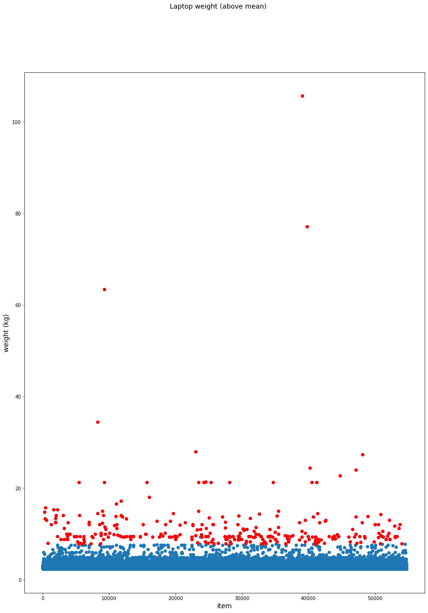
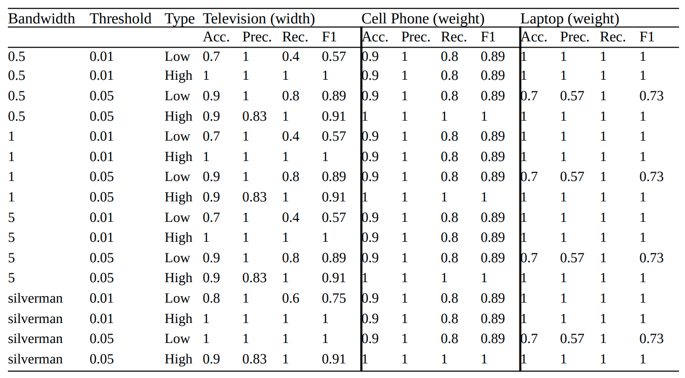

# Kaufland Product Data Importer
## A project of the Udacity Data Science Nanodegree

## Project Overview
This is the final project of the Udacity Data Science Nanodegree. The project itself is not given
by Udacity, but instead it is up to the user to decide for an own project with its own data and problem
to solve.

I have decided to make use of product data of Kaufland.de a German online marketplace.

The project covers the fundamental steps of a data science project:
- Problem definition
- Data analysis
- Model development
- Model evaluation
- Usage of the model in a web application

## Problem Statement
The main goal was to develop a system to automatically detect unusual values of numerical attributes 
for certain product categories. The data is provided by the sellers selling on the marketplace. However,
there are numerous reasons, why this approach can lead to data being not correctly interpreted by the
system. For example the data could be entered with the wrong unit in mind, so the interpreted 
value might be off by several magnitudes from the actual value.\
Poor product data leads to a bad UX for customers of the marketplace. Search filters cannot work properly
if the underlying data is not correct.\
It is therefore in the interest of the marketplace to have an as good as possible data quality.

Assuming that the majority of data is entered correctly, those wrong values should appear relatively 
rarely compared to valid values and therefore an outlier detection algorithm should be able to identify
those values.

## Metrics
To determine the performance of the used approach I have had a look at the common metrics for binary 
classifications (outlier vs. non-outlier), i.e. accuracy, precision, 
recall and F1-score. Because the available data was unlabeled I created some test data with labels and compared the
expected results with the results of the model. Note, as each category and each attribute has its own model and thus
needs its own data, I did the evaluation only for a subset of them.\
Results are presented further down in section "Model Evaluation and Validation".

## Data Exploration & Data Visualization
### Dataset
The raw dataset used for this project is about 29 MB and contains 245,613 rows and 13 columns.
The columns are as follows:
- `id_item`: Hashed Item ID
- `category`: Category ID
- `name_category`: Category Name
- `is_valid`: Flag whether the item is valid
- `is_blacklisted`: Flag whether the item has been blacklisted
- `screen_size`: Product screen Size
- `width`: Product width
- `weight`: Product weight
- `height`: Product height
- `length`: Product length
- `depth`: Product depth
- `storage_size`: Storage Size of a data storage device
- `camera_pixel_max`: Camera pixels

### Data Analysis

High level statistics of each numerical attribute is shown in the following image:

A total of 36,739 items are invalid and 1,977 are blacklisted

The following image shows the count of items in each product category:

(Translations: `schreibtische` -> `desks`, `handys` -> `cell phones`, `fernseher` -> `televisions`,
`spiegelreflexkameras-dslr` -> `reflex cameras`)

In the beginning I was interested whether there are actually obvious outliers in the given attributes, so I started
by looking at some box plots:

**Cell Phones**

**Laptops**

**Televisions**

As can be seen, there are outliers in all attributes.

At this point I was interested in the distribution of some attributes to get a better decision basis on which 
statistical approach would be best suited to detect those outliers.

Common approaches like Z-scores or interquartile range are only reliable if the given data follows a normal distribution.
However, after checking some attributes' data it was clear, that they are quite skewed to the right and do not follow
a normal distribution.
Therefore, I have decided to go with a non-parametric way: Kernel Density Estimation (KDE). KDE estimates a density curve
over the sample data. With this density curve, represented by a probability density function (PDF), one can calculate
a probability at any given point. A low value means that the probability of being a correct value according to the 
product domain (e.g. a laptop weighing 20 kg) is low and therefore more likely to be considered as an outlier.

Note: Because the products do not have a lot of different numerical attributes, I have decided against using other, 
common machine learning algorithms, which can be used for multidimensional data (e.g. DBSCAN). For one-dimensional data
using KDE seemed to be more suitable.

## Data Preprocessing
The following steps have been taken to clean the data:
- Removal of invalid items (certain attributes are missing that are required by the marketplace)
- Removal of blacklisted items
- Removal of possible duplicate items

Note: Though there are NaN values in each attribute I did decide to not include this stepi n the cleaning process.
The reasoning is a follows:
Any replacement, e.g. with mean, average, max, min etc. would change the result of the calculated PDF, hence I would
introduce a bias. Removing those rows would also not make sense, as a row might have one attribute missing, but another
attribute might be available. Because every attribute in each category has its own PDF, removal of the whole row would
therefore remove valid data points of other attributes.\
Instead, when the PDFs are generated, all NaN values for the respective attribute get removed.

## Implementation 
Python 3.8 together with Javascript, HTML & CSS has been used for this project.\
The project contains a `src` folder which in turn contains three other folders:
- `app`: Contains code related to the web app
- `data`: Contains a script for preprocessing
- `model`: Contains a script for training the model

`app` contains the following files:
- `static/index.js`: A javascript file for making use of jquery
- `static/master.css`: A css file for the index.html page
- `static/processed.css`: A css file for the processed.html page
- `templates/index.html`: The main HTML file
- `templates/processed.html`: HTML file shown after product data has been submitted
- `run.py`: Entrypoint for starting the application. It starts a local web server using flask
with two endpoints

`data` contains the following files:
- `numeric_product_data_attributes.py`: Contains a python dictionary which gives information about 
the attribute each category uses. This is getting used by other files.
- `preprocessing.py`: Entrypoint to start the preprocessing process

`model` contains the following files:
- `generate_kde_models.py`: Entrypoint to generate the KDE models. For each category and each attribute
within that category two models are created. One for values above the median, and one below it
- `kde_models/`: An initially empty folder which will later be filled with the generated models

Furthermore, the raw dataset (`numeric_attributes_raw.csv`) itself can be found in the root folder

### How to Run
To get started with the project run the following command in the root directory:
1. `pip install -r requirements.txt`
2. `pip install --editable .`
3. `python src/data/preprocessing.py numeric_attributes_raw.csv src/ProductData.db`
4. `python src/model/generate_kde_models.py src/ProductData.db src/model/kde_models/`
5. `python src/app/run.py`

Go to http://127.0.0.1:3001/

Note: You need to be within a Python virtual environment:
- Run `python -m venv env` in the root folder
- Afterwards run `source env/bin/activate`

### Libraries
Libraries used for the web application can be found in `requirements.txt`.\
For the data analysis part the following libraries where used:
- pandas
- numpy
- matplotlib
- sklearn
- scipy

### Web Application
The implemented web application simulates a very primitive product data import interface. A seller can decide for which
product category they would like to add an item, e.g. laptops, cell phones, etc. The seller then adds a product title
as well as necessary numerical attributes.\
Before a data can be submitted the data validation must be triggered. This is where the backend makes use of the 
developed outlier detection model to decide, whether the input values for the numerical attributes seem too high or too
low. If so, the seller is informed that they should re-assure that everything is correct.\
Even if the system marks a value as an outlier, it does not prevent the seller from submitting the data. Reasoning is
that there are valid products for which certain attributes are lying outside the normal range. So the system might
mention false positives to the seller.

## Refinement
While the initial idea was to use a clustering algorithm it became quite early on clear that for 
one-dimensional data the Kernel Density Estimation was a better fit. So after reading about different
clustering approaches I relatively fast switched to read myself into the topic of KDE.

## Model Evaluation and Validation
During the data analysis part I have looked at the plotted data for some attributes. The following shows the 
weight for laptops above the mean (for better visual representation). As can be seen, the outliers (red) are all values 
with higher values, so the model generally seems to work as expected.

For a more thorough evaluation of the model performance I have had a look at the metrics accuracy, precision, 
recall and F1-score.\
An important factor in KDE that influences how the PDF is calculated, is a parameter called `bandwidth`. See 
[this link](https://aakinshin.net/posts/kde-bw/) for a good explanation of this parameter.\
Another factor is the threshold which is chosen to divide outliers from non-outliers. Those two factors mainly 
determine a models performance.\
As can bee seen in the table below, different category-attribute combinations perform better on different 
combinations of bandwidth and threshold. This is not surprising, as every attribute has its own value distribution.
For the sake of simplicity in the scope of this project, I have chosen the same threshold for all models, 0.01,
in the web application. 
This means that the 1%-percentile for each attribute is used as a limit value to decide if a value is considered as 
an outlier or not.\
The second parameter, bandwidth, can be calculated dynamically with the help of a bandwidth selection algorithm, e.g. 
[Silverman's rule of thumb](https://archive.org/details/densityestimatio00silv_0/page/44/mode/2up). This 
algorithm is available in the [gaussian_kde class](https://docs.scipy.org/doc/scipy/reference/generated/scipy.stats.gaussian_kde.html) of the scipy
package, used in this project. So every category-attribute combination gets potentially a different bandwidth 
parameter.

For evaluating the different models I have used the following values for the bandwidth and threshold
parameters:
- Bandwidth: 0.5, 1.0, 5.0, Silverman's rule of thumb
- Threshold: 0.01, 0.05

Overall, we can see that the models perform very well on the test data. The finally chosen parameter combination in 
the web application is as follows:
- Bandwidth: Silverman's rule of thumb
- Threshold: 0.01

## Justification
Since it was quite early clear that a clustering approach, which is commonly used for multidimensional
data, is not needed here and that KDE would be a suitable approach, I did not spend much time at checking
the outcome of another approach.

## Reflection
Online marketplaces, like Kaufland.de, are sitting on lots of data which they can potentially make use of. However,
the data quality is an important factor. Especially with data input by external parties, e.g. sellers, the quality often
times is not optimal, which prevents an easy usage of it. For that reason it is helpful to have systems in place which
automatically detect wrong data records.\
In the case of numerical attributes those wrong data points can be detected by outlier detection systems.\
Kernel Density Estimation is such a suitable approach to detect outliers in one-dimensional data which is not following a
normal distribution. With the help of KDE it is possible to create a probability density function without much prior 
knowledge about that underlying data.

Something that I learned during this project is that to solve a problem, it is not always necessary to make
use of the most modern, fancy machine learning techniques out there. Sometimes very common statistical
approaches can solve the problem equally well with less effort. For normal distributed data even a simple
approach like calculation of a Z-score might be sufficient.

### Possible Improvement
To determine whether a data point is considered as an outlier a threshold is required which defines the limit for 
outliers. In the current solution the PDF is calculated based on the assumption that the dataset contains outliers
and that ~1% of data points would be considered as such. If the dataset quality would improve over time and the amount
of outliers would decrease, the algorithm would still assume 1% of data points to be outliers, even though they are valid.

